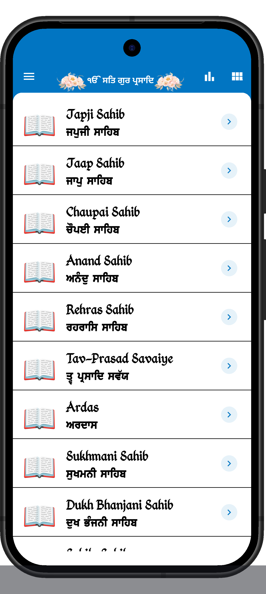
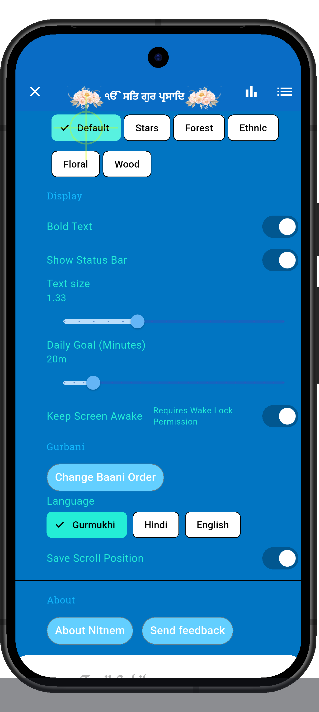
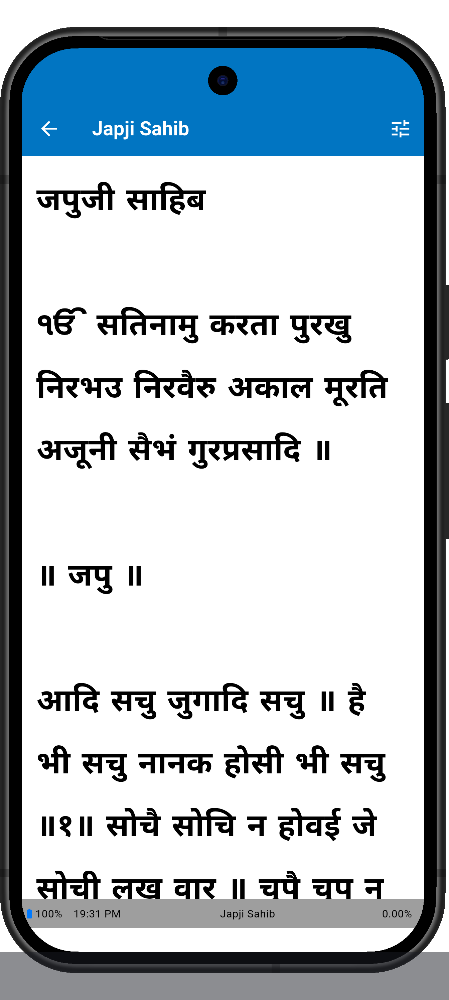
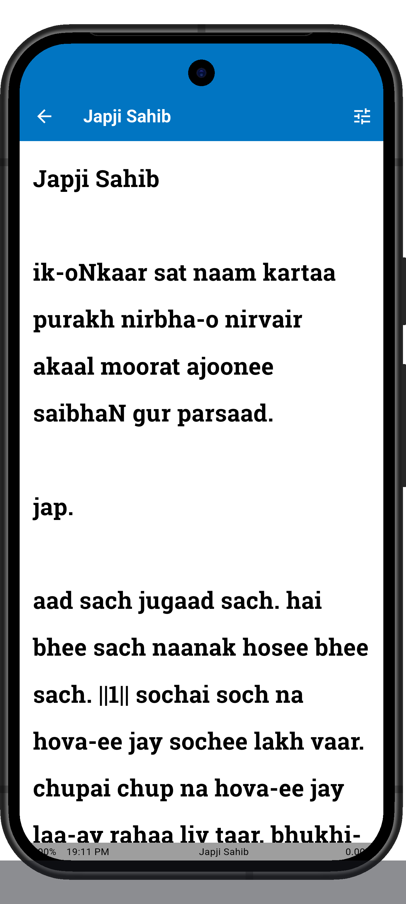
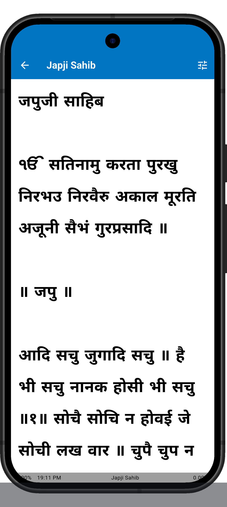

# Nitnem App

[](https://codemagic.io/apps/60d59c6d17ecbd2b0fcca3b0/release-build-google-play/latest_build)
[](https://flutter.dev)

| [Google Play](https://play.google.com/store/apps/details?id=com.manpreet.nitnem) |
| :---: |
| <a href="https://play.google.com/store/apps/details?id=com.manpreet.nitnem"></a> |

## Introduction

Nitnem literally translates to "daily routine" or "constant discipline" from the Punjabi words **nit** (daily) and **nem** (rule or practice)

This app provides the daily Baanis (verses) that are recited by Sikhs every morning, evening, and before going to sleep. 
- **Morning**: Japji Sahib, Jaap Sahib, Tav-Prasad Savaiye, Chaupai Sahib, and Anand Sahib.
- **Evening**: Rehras Sahib.
- **Night**: Sohila Sahib.

## ✨ Features

- **🌍 Multilingual Support**: Read Baanis in **Gurmukhi**, **English**, and **Hindi**.
- **🎨 Customizable Themes**: Personalize your experience with multiple background patterns (Forest, Stars, Ethnic, etc.).
- **📍 Scroll Persistence**: Automatically saves your reading position for each Baani, so you can resume exactly where you left off.
- **🔢 Custom Baani Ordering**: Organize the Baanis in the order you prefer to recite them.
- **📊 Reading Status Bar**: Stay informed with an integrated status bar showing battery level, current time, and your reading progress percentage.
- **👁️ Display Options**:
    - **Bold Text**: Toggle for better visibility.
    - **Text Scaling**: Adjust font sizes for comfortable reading.
    - **Stay Awake**: Keep the screen on while reading.

## 🛠 Tech Stack

- **Framework**: [Flutter](https://flutter.dev/) - Modern, cross-platform UI toolkit.
- **State Management**: [Redux](https://pub.dev/packages/redux) - For predictable and consistent application state.
- **Persistence**: [Shared Preferences](https://pub.dev/packages/shared_preferences) - Reliable local storage for user settings and progress.
- **UI Components**: [Backdrop](https://pub.dev/packages/backdrop) for seamless settings access.

## 🚀 Getting Started

### Prerequisites
- Flutter SDK (stable channel)
- Android Studio / VS Code

### Local Development
1. **Clone the repository**:
   ```bash
   git clone https://github.com/manpreets/nitnem.git
   cd nitnem
   ```
2. **Install dependencies**:
   ```bash
   flutter pub get
   ```
3. **Run the app**:
   ```bash
   flutter run
   ```

## 📸 Screenshots

| Home Screen | Options | Gurmukhi |
| :---: | :---: | :---: |
|  |  |  |

| English Translation | Hindi Translation |
| :---: | :---: |
|  |  |

## 🙏 Respectful Usage

Please respectfully cover your head and remove your shoes before using this app to recite Gurbani.

---
**Waheguruji ka Khalsa, Waheguruji ki Fateh.**
Sangat ji, any comments, suggestions, and corrections are welcome.
